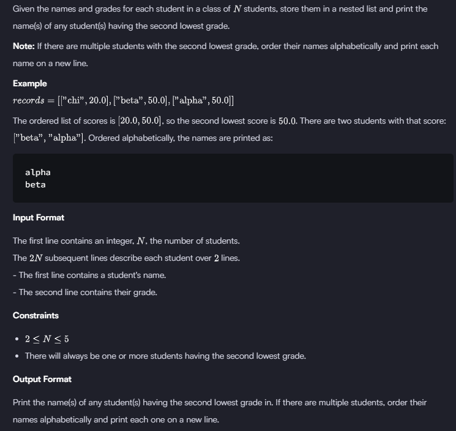

### HACKERRANK

#### Q. 


```First Solution```

```python
#defining method here
def sorted_names(names_score):
    # getting scores in a list
    sorted_score = []
    for student_score in names_score:
        sorted_score.append(student_score[1])
    # sorting and stroring the second lowest score     
    sorted_score = sorted(set(sorted_score)) # SET: to get unique values
    second_lowest = sorted_score[1]
    
    # getting names of the lowest scores    
    names_second_lowest = []    
    for names in names_score:
        if names[1] == second_lowest:
            names_second_lowest.append(names[0])
    # sorting names alphabetically
    names_second_lowest = sorted(names_second_lowest)        
            
    # printing names in new line
    for studentName in names_second_lowest:
        print(studentName)
        
        
if __name__ == '__main__':
    names_score = []
    for _ in range(int(input())):
        name = input()
        score = float(input())
        # saving names & scores in nested list
        names_score.append([name, score])
        
    sorted_names(names_score)
```
>- Time Complexity (TC): O(n+klogk+mlogm) [Since k and 𝑚 are typically much smaller than 𝑛, the dominant term is O(n).]
>- Space Complexity (SC): O(n)+O(k)+O(m)≈ O(n)