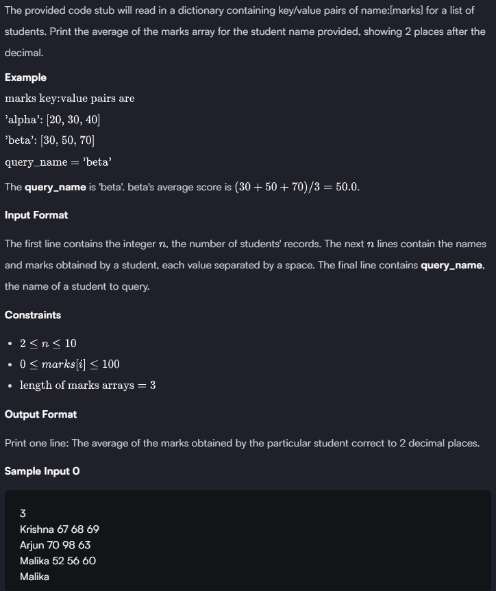

### HACKERRANK

#### Q. 


```First Solution```

```python
# defining method
def Avg_marks(student_marks, query_name):
    for key, value in student_marks.items():
        if key == query_name:
            avgScore = sum(value)/len(value)
    print('{:.2F}'.format(avgScore))    # Formats the avgScore to 2 decimal places as a floating-point number.


if __name__ == '__main__':
    n = int(input())
    student_marks = {}
    for _ in range(n):
        name, *line = input().split() 
        scores = list(map(float, line))
        student_marks[name] = scores
    query_name = input()
    
    Avg_marks(student_marks, query_name)
    
''' name, *line: The first word of the input is assigned to the variable name (e.g., the student's name). The rest of the words are collected into the list line using the unpacking operator (*). '''
#.split(): Splits the input string into a list of words, using spaces as the delimiter.
# map(float, line): Applies the float function to each element of the line list, converting strings to floating-point numbers (e.g., scores).
# list(): Converts the map object into a list of floats.
```