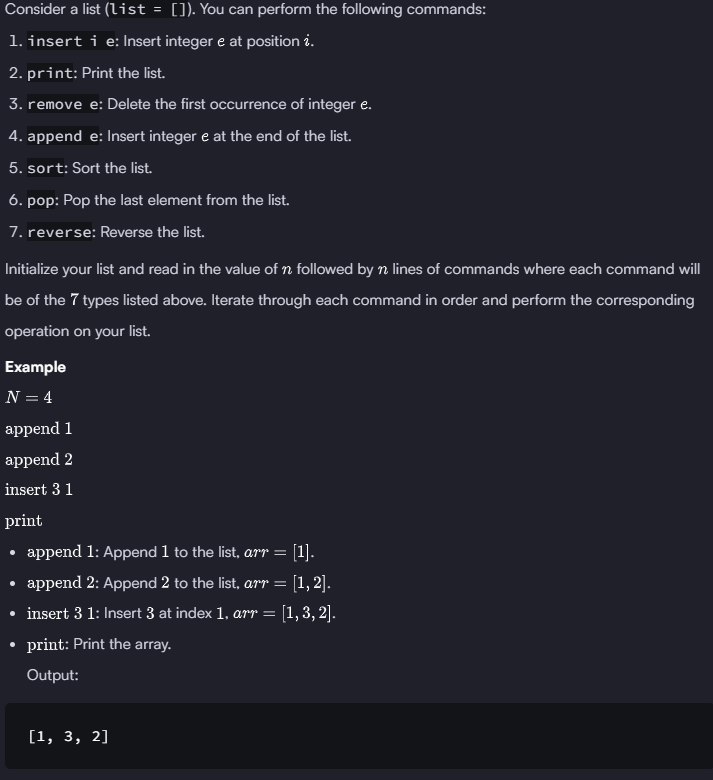

### HACKERRANK 

#### Q. 


```First Solution```

```python
if __name__ == '__main__':
    N = int(input())
    mylist = []
    
    for _ in range(N):
        userInput = input().split()
      
        if userInput[0] == 'insert':
            mylist.insert(int(userInput[1]), int(userInput[2]))
        elif userInput[0] == 'print':
            print(mylist)
        elif userInput[0] == 'remove':
            mylist.remove(int(userInput[1]))
        elif userInput[0] == 'append':
            mylist.append(int(userInput[1]))
        elif userInput[0] == 'sort':
            mylist.sort()
        elif userInput[0] == 'pop':
            mylist.pop()
        elif userInput[0] == 'reverse':        
            mylist.reverse() 
```
