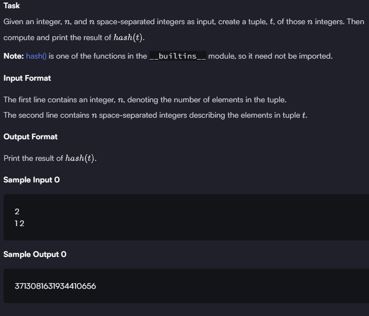

### HACKERRANK 

#### Q. 


```First Solution```

```python
if __name__ == '__main__':
    n = int(input())
    integer_list = map(int, input().split())
    integerTuple = tuple(integer_list)  # tuple(integer_list): converts list into tuples
    
    print(hash(integerTuple))
```
