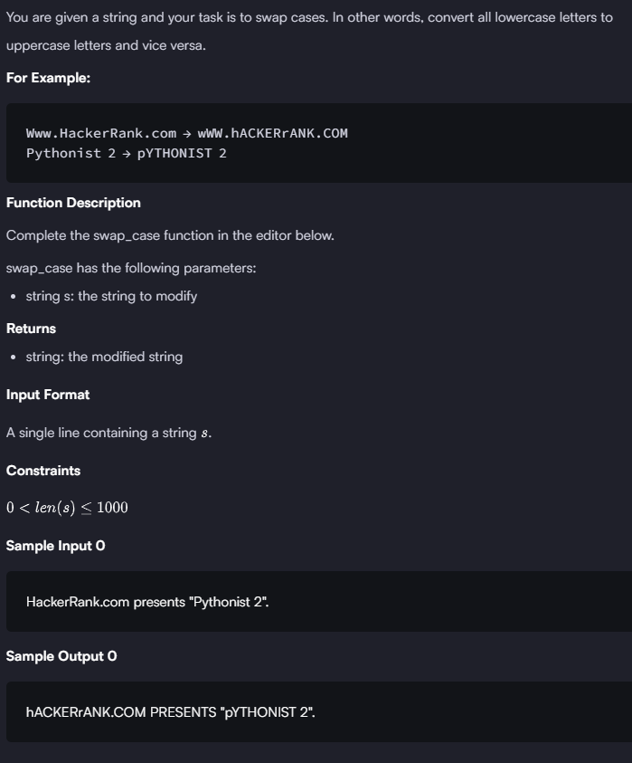

### HACKERRANK 

#### Q. 


```First Solution```

```python
def swap_case(s):
    new_s = []
    
    for item in s:
        if item.isalpha():
            if item.islower():
                new_s.append(item.upper())
            else:
                new_s.append(item.lower())
        else:
            new_s.append(item)    
    return ''.join(new_s) # convert list into string
    
    
    
if __name__ == '__main__':
    s = input()
    result = swap_case(s)
    print(result)
```
