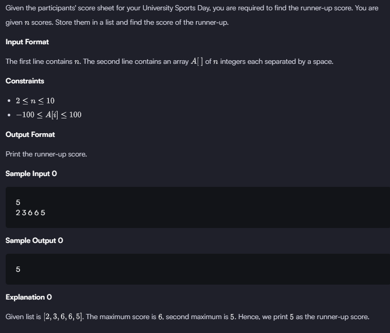

### HACKERRANK

#### Q. 


```First Solution```

```python
if __name__ == '__main__':
    n = int(input())
    arr = map(int, input().split())

# The expression "arr = map(int, input().split())" takes a space-separated string input from the user, splits it into a list of substrings, and converts each substring into an integer using map(), storing the result in the variable 'arr' as an iterable.
    
Scores = list(arr)
Scores.sort()
Max = Scores[n-1]

for i in reversed(Scores):
    if Max != i:
        Max= i
        break
print(Max) 
```
>- Time Complexity (TC): O(n log n) (due to sorting).
>- Space Complexity (SC): O(n) (due to the list Scores. Scores = list(arr) creates a list that stores n integers. Thus, the space required for this is O(n)).